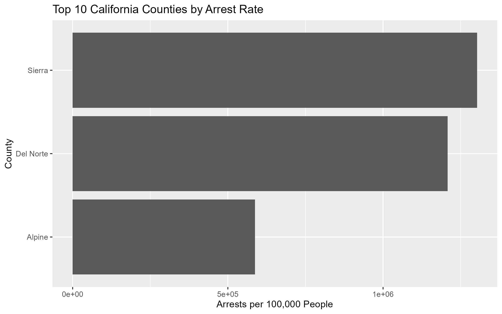
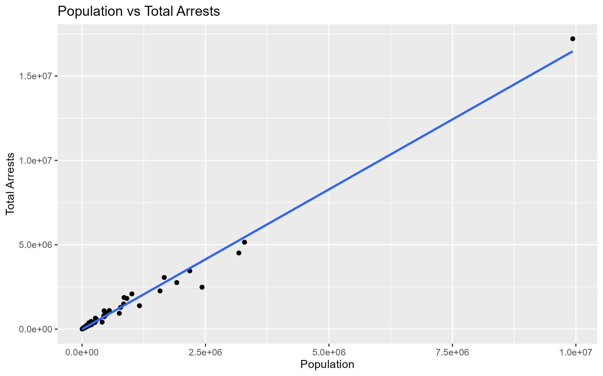
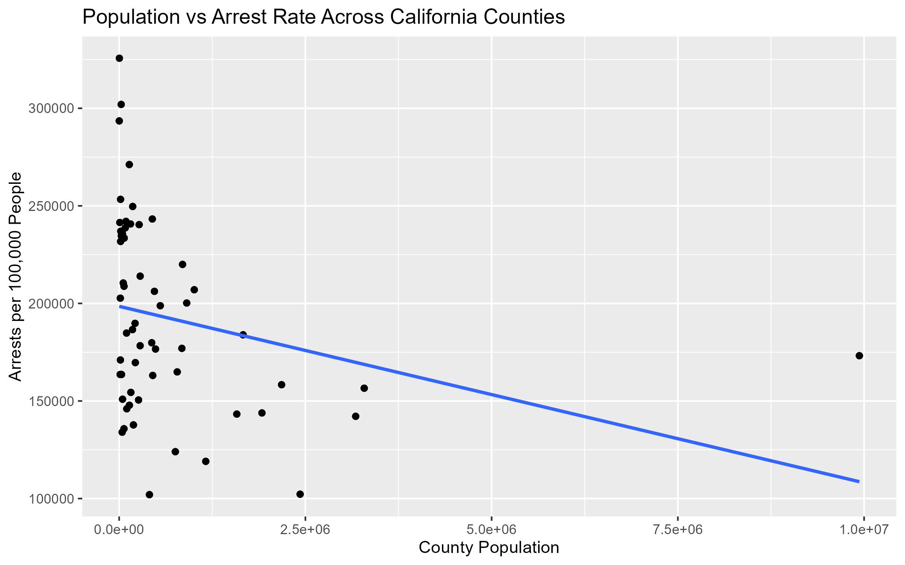
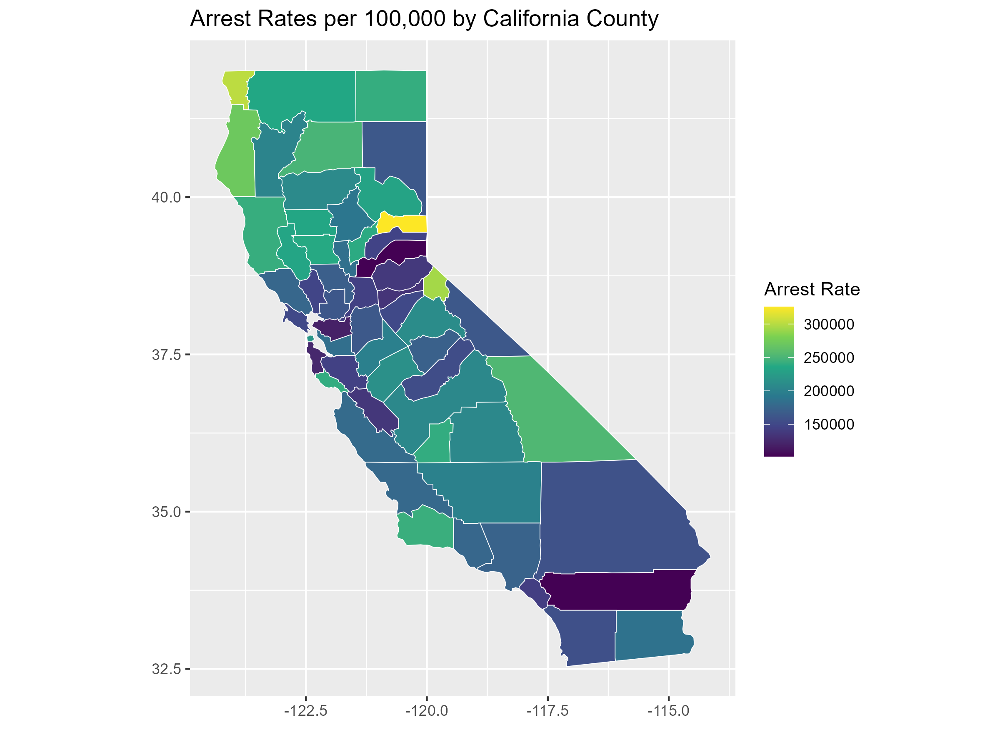

```{r setup, include=FALSE}
library(ggplot2)
library(here)

knitr::opts_knit$set(
  root.dir = "C:/Users/naomi/OneDrive/Desktop/ECNS 460_Advanced Data Analytics/Project_Pardee"
)

knitr::opts_chunk$set(
  echo = FALSE,
  warning = FALSE,
  message = FALSE
)
```


## Project Overview

This project examines how arrest rates vary across California counties after adjusting for population size. The main research question is: **How do arrest rates per capita vary across California counties, and how are they related to county population size?**

This topic matters because raw arrest counts can be misleading. Larger counties naturally have more arrests because they have larger populations. Calculating arrest rates per 100,000 people allows counties of different sizes to be compared more fairly and highlights geographic differences in arrest activity.

This analysis uses two datasets. The first is California county-level arrest data from the California Department of Justice, which includes arrests by county and demographic categories such as year, gender, race, and age group. The second is U.S. Census population data, which provides county-level population estimates used to calculate arrest rates per capita.

This project uses descriptive analysis rather than causal analysis. The goal is to identify patterns in arrest rates across counties and examine how arrest rates relate to population size.

## Data Processing

Both datasets require substantial cleaning before analysis. The Census dataset is originally stored in a wide format, with counties as columns and variables as rows. I filter the dataset to keep total population estimates and reshape the data so each county has a single population value.

The arrest dataset also requires cleaning because arrests are separated across demographic categories. I combine felony, misdemeanor, and status arrest totals into a single measure and aggregate arrests to the county level.

After cleaning both datasets, I standardize county names and merge the datasets by county. I then calculate arrest rates per 100,000 people using:

\[
\text{Arrest Rate per 100,000} =
\frac{\text{Total Arrests}}{\text{Population}} \times 100,000
\]

I also estimate a simple regression model to examine the relationship between county population and arrest rates:

$$
\text{ArrestRate}_i = \beta_0 + \beta_1 \cdot \text{Population}_i
$$

where \(i\) indexes counties.


## 1. RESEARCH QUESTION AND MOTIVATION

*This project asks: How do arrest rates per capita vary across California counties, and how are they related to population size?*

This question matters because raw arrest counts can be statistically skewed, and therefore can be misleading. Larger counties naturally have more arrests simply because they have more people. Adjusting arrests by population allows for more meaningful comparisons across counties and provides a clearer picture of how arrest activity differs geographically.

## 2. ANALYTICAL APPROACH

This project uses descriptive analysis. The goal is not to establish causality, but rather to identify patterns in the data and quantify relationships between variables.

I use visualizations to compare total arrests, population, and arrest rates across counties. I also estimate a simple regression model to examine whether county population is related to arrest rates per 100,000 people.

## 3. DATA AND METHODS

The analysis uses two datasets. The first is county-level arrest data, which includes arrests by county and demographic categories such as year, gender, race, and age group. Because the arrest data is split across demographic groups, I aggregate the data to calculate total arrests for each county. The second dataset is U.S. Census population data, which provides county-level population estimates. This population data is used to convert raw arrest counts into arrest rates per 100,000 people.

The datasets are related through county names. After cleaning and standardizing the county names, I merge the arrest totals with the Census population estimates. This allows each county’s total arrests to be compared with its population size. I then calculate:

Both data sets require a lot of cleaning. The Census data is originally in a wide format, with variables stored in rows and counties stored in columns. I reshape the data into a long format and extract population estimates for each county.

The arrest data is also not immediately usable, as arrests aree split across demographic categories. I aggregated arrests across these categories to calculate total arrests by county.

After cleaning both data sets, I standardized county names and merged them. I then calculated arrest rates per 100,000 people:

Arrest Rate per 100,000 = (Total Arrests/Population) x 100,000

To quantify the relationship between population and arrest rates, I estimated:

$$
\text{ArrestRate}_i = \beta_0 + \beta_1 \cdot \text{Population}_i
$$

where i indexes counties.

To recap, two data sets were used in this project:

County-level arrest data (by year, gender, race, and age group)
U.S. Census population data by county

## 4. CHALLENGE

For the project challenge, I incorporate both static and interactive spatial visualizations. I use California county map data in R to create a choropleth map showing arrest rates per 100,000 people by county, and then convert the map into an interactive visualization using the plotly package.

The interactive map extends the analysis by allowing viewers to explore geographic variation in arrest rates more directly through hovering and zooming. This makes regional patterns and county-level differences easier to identify than with summary statistics or tables alone. 

## 5. RESULTS

The analysis includes summary statistics, a binned bar chart, and a scatter plot comparing population and total arrests, a ranking of counties by arrest rate, a simple regression of arrest rate on population, and a county-level map of California arrest rates. The challenge I am choosing is the spatial visualization challenge because I use county map data in R to show how arrest rates vary geographically across California.


## Figure 1: Top 10 California Counties by Arrest Rate




```{r, echo=FALSE, out.width="80%"}
knitr::include_graphics("Images/top_10_arrest_rates.png")
```

This figure shows the counties with the highest arrest rates after adjusting for population. I use a horizontal bar chart because it makes county names easier to read and allows comparisons across counties. I show only the top 10 counties to keep the figure clear and readable.

The figure shows that smaller counties such as Sierra, Del Norte, and Alpine have some of the highest arrest rates per 100,000 people. This supports the project’s main point that raw arrest totals can be misleading because large counties do not necessarily have the highest arrest rates once population is considered.


## Figure 2: Population vs. Total Arrests



```{r figure-2, echo=FALSE, out.width="90%"}
knitr::include_graphics("Images/population_vs_total_arrests.png")
```


The purpose of this figure is to show the relationship between county population and total arrests. I use a scatterplot because both variables are numeric, and this type of graph clearly displays relationships between continuous variables. Each point represents a county, and the regression line summarizes the overall trend.

The figure shows a strong positive relationship between population and total arrests, with larger counties generally having more arrests. This demonstrates why raw arrest totals alone are not sufficient for comparing counties.

## Figure 3. Arrest Rates per 100,000 by County



```{r figure-3, echo=FALSE, out.width="90%"}
knitr::include_graphics("Images/arrest_rate_map.png")
```


The purpose of this figure is to show how arrest rates vary geographically across California counties after adjusting for population size. I used a county-level static map because spatial visualizations make regional patterns easier to identify than a table or standard graph.

I chose color shading to represent arrest rates per 100,000 people, with darker colors indicating higher arrest rates and lighter colors indicating lower rates. This allows viewers to quickly compare counties and identify areas with relatively high or low arrest activity. I also used county boundaries and a fixed coordinate system to preserve the geographic shape of California and make the map easier to interpret.

This visualization supports the project’s purpose by showing that arrest rates are not evenly distributed across the state. Some counties stand out even after adjusting for population, suggesting that factors beyond population size may influence arrest activity.

## Figure 4. Population vs. Arrest Rate by County



```{r figure-4, echo=FALSE, out.width="80%"}
knitr::include_graphics("Images/population_vs_arrest_rate.png")
```

The purpose of this visualization (Figure 4) is to show how county population relates to arrest rates per 100,000 people. A scatter plot is used because it clearly displays the relationship between two continuous variables, with each point representing a county. A linear trend line is added to summarize the overall pattern.

These choices make it easy to see that the relationship is negative, with larger counties tending to have lower arrest rates per capita. At the same time, the wide spread of points around the line shows that population alone does not explain much of the variation, which is consistent with the regression results.


*Figure 5. Interactive Arrest Rate Map*

The interactive state map is an interactive map of arrest rates per 100,000 people by California county. The map was created by converting the static county map into an interactive `plotly` object and saving it as an HTML widget. This allows the viewer to explore geographic variation in arrest rates more directly than a static image.

The interactive map shows that high arrest rates are concentrated in certain counties rather than evenly spread across the state. This reinforces the regression result that population explains only a small share of the variation in arrest rates.

## 6. INTERPRETATION

Population strongly influences total arrests but explains relatively little variation in arrest rates per capita. Larger counties generally report more arrests overall, while smaller counties often have higher arrest rates after adjusting for population.

The analysis shows why population-adjusted measures are necessary when comparing counties. Conclusions based only on raw arrest totals would largely reflect population size rather than differences in arrest activity.

The regression results also suggest that factors beyond population size likely influence arrest rates, including demographics, economic conditions, and policing practices.

## 7. Challenge Completed

For the project challenge, I add an interactive spatial visualization. After creating a static county map of California arrest rates, I use the `plotly` package to convert the map into an interactive figure with `ggplotly()`. I then saved the interactive map as an HTML file using `saveWidget()` from the `htmlwidgets` package.

This method allowed the map to be viewed as a standalone interactive file rather than only as a static image. The interactive version makes it easier to explore county-level variation because the viewer can hover over the map and examine the data more closely.

The map shows that arrest rates per 100,000 people are not evenly distributed across California. Some counties stand out with higher arrest rates even after adjusting for population. This supports the main interpretation of the project: population alone does not explain arrest rate differences across counties.

One challenge I faced includes learning how to move from a static `ggplot` map to an interactive HTML output. I also need to make sure the map object appears correctly before converting it with `ggplotly()`, and that the final HTML file saves in the correct `Images` folder. From this, I learn that interactive visualizations requires an extra step beyond normal plotting: the graph must be converted into an HTML widget and saved separately.

Overall, this challenge helps me learn how interactive tools can make data analysis more useful and easier to interpret. Instead of only presenting a fixed map, the interactive version allows one to explore the spatial pattern directly.

## 8. REFLECTION

A major challenge in this project is preparing the data. The Census dataset is not originally stored in a tidy format, and the arrest dataset separates arrests across multiple demographic categories. Cleaning the data requires reshaping variables, aggregating arrests, and matching county names across datasets.

I also encounter technical challenges, including incorrect file paths, missing functions, and inconsistent variable names. These issues reinforce the importance of carefully checking data structure and verifying each step of the analysis.

Overall, this project improves my ability to clean, merge, visualize, and analyze real-world datasets.

## 9. CONCLUSION

This analysis shows that larger counties have more arrests overall, but smaller counties often have higher arrest rates per capita. Population is negatively related to arrest rates, but it explains only a small share of the variation.

A more complete analysis would include additional variables such as income, demographics, or crime composition. Nonetheless, this project demonstrates the importance of using population-adjusted measures when comparing across regions.